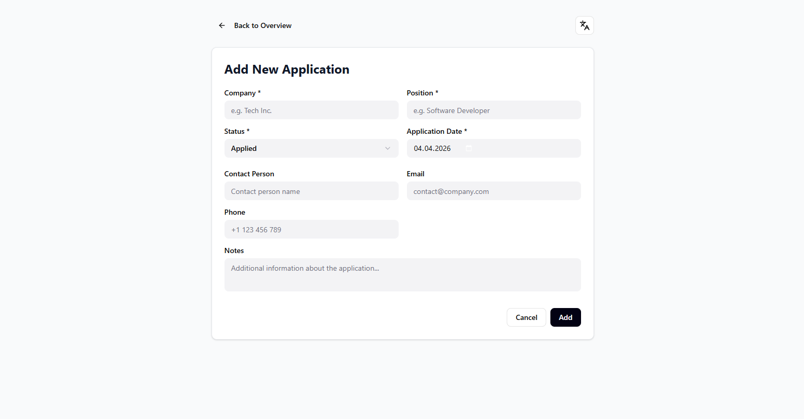

# Job Application Tracker


## 📌 Project Overview
The **Job Application Tracker** is a centralized web application designed to help job seekers efficiently manage and track their application process. Instead of scattering information across emails, spreadsheets, and notes, this app provides a structured overview of all relevant data in one place.

*This project was built to demonstrate proficiency in backend development, MVC architecture, and database design using the Spring Boot ecosystem.*




---

## ⚡ Core Features
- **Application Management**: Create, read, update, and delete (CRUD) job applications.
- **Status Tracking**: Keep track of application stages (`APPLIED`, `INTERVIEW`, `OFFER`, `REJECTED`).
- **Company Directory**: Manage information about target companies.
- **Notes System**: Attach custom notes to individual applications.
- **Interview Scheduling**: Centralized tracking of upcoming interview appointments.

---

## 🛠️ Tech Stack & Architecture

### Backend
- **Java 17**
- **Spring Boot** (WebMVC, Data JPA)

### Frontend
- **Thymeleaf** (Server-side rendering)
- **HTML5, CSS3, JavaScript**

### Database
- **H2 Database**: Used for fast local development, testing, and debugging.
- **MySQL**: Designed and configured for production environments.

### Testing & Quality
- **JUnit 5 & Mockito**: For robust unit and integration testing.

---

## 🚀 Getting Started

### Prerequisites
- JDK 17 or higher
- Maven 3.8+
- *(Optional)* MySQL server if running the production profile

### Installation & Setup

1. **Clone the repository:**
   ```bash
   git clone https://github.com/YourUsername/job-application-tracker.git
   cd job-application-tracker
   ```

2. **Build the project:**
   ```bash
   ./mvnw clean install
   ```

3. **Run the application:**
   Using the default in-memory H2 database profile:
   ```bash
   ./mvnw spring-boot:run
   ```

4. **Access the Application:**
   Open your browser and navigate to: `http://localhost:8080`

---

## 💡 Technical Highlights / What I Learned
* **REST API Design**: Designed clean and semantic endpoints for managing applications, companies, and interviews.
* **Data Persistence**: Implemented Spring Data JPA repositories with Hibernate to map Java objects to relational tables.
* **MVC Pattern**: Separated business logic (Services), routing (Controllers), and UI (Thymeleaf Views) for maintainable code.
* **Database Agnosticism**: Configured the application to switch smoothly between an in-memory H2 database for dev and MySQL for production.

---

*If you like this project, feel free to leave a ⭐ on the repository!*